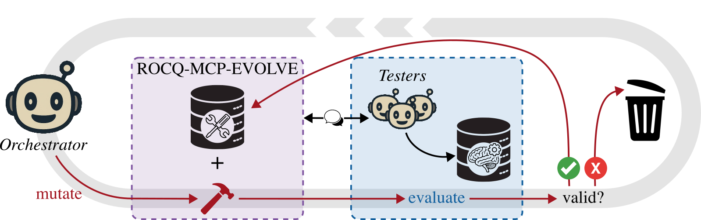
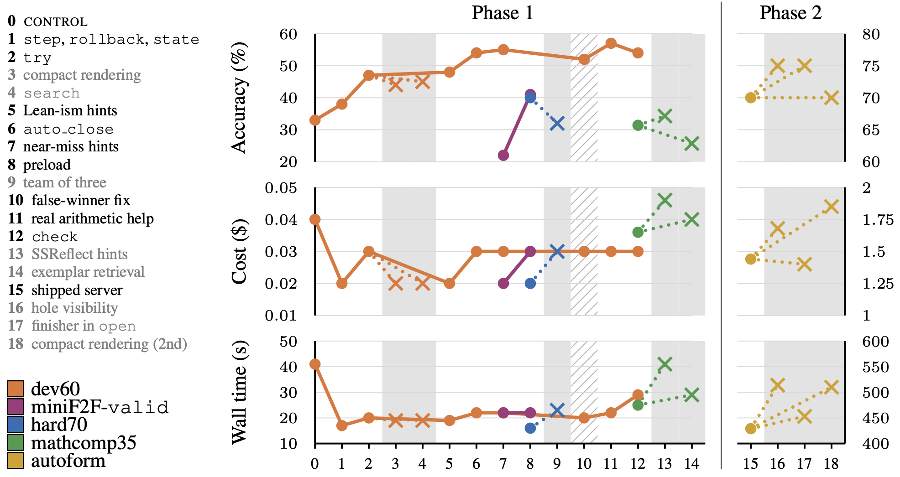
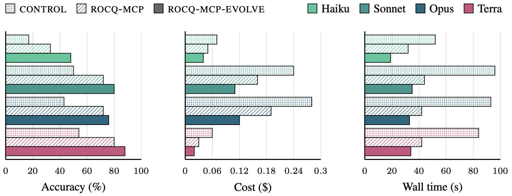

# rocq-mcp-evolve-experiment

We propose an evolutionary method building an MCP server for the Rocq proof assistant.

We start with a basic MCP server exposing only the Rocq compiler.
At each step, a frontier model *mutate* the existing MCP server by adding a new feature, *evaluate* this new server with smaller models, and only keeps mutations that improve overall performance.
A detailed diagram representing a step of the evolutionary method is given:



We demonstrate the effectiveness of our method by growing, on a curated set of mathematical problems, rocq-mcp-evolve, a new MCP server for the Rocq prover.
The metrics on which we measure the performance of an MCP server are: the *accuracy* (the success rate), the *cost* per solve, and the *wall time* per solve.
Here is the evolution of metrics along the growing of rocq-mcp-server:



On the held-out `test` split of miniF2F-Rocq, an agent equipped with rocq-mcp-evolve outperforms both the baseline that only exposes the Rocq compiler (control) and an established MCP server (rocq-mcp), across four models from two families (Claude Haiku 4.5, Claude Sonnet 5, Claude Opus 4.8, and GPT-5.6 Terra). Here are the results for all three metrics:



This repository contains the server, the harness that ran the evolution and the evaluation, and the scripts that regenerate every reported number from the campaign logs.

- `src/session_server/` — rocq-mcp-evolve. It is entirely written in OCaml on top of the Rocq runtime API. The server maintains a live interactive session with the agent: it enables the agent to apply tactics to advance the proof state, to backtrack, and to access the current proof state, exposes simple automation tools that can be used to close simple proof goals, and exposes verification tools to check the validity of a proof or of an entire project.
- `src/baseline_server/` — the control MCP server that only exposes a single tool: compile an entire file.
- `src/files_server/` — the file manipulation tools (`read`, `write`, `list`, `dune_build`, `verify`) given to every server on the project-scale tasks.
- `lean-experiment/` — the Lean 4 port, `lean-mcp-evolve`: server, gate, tests, dataset, and its experiment harness, configs and logs (see "Using the Lean server" below).
- `harness/` — the runners for every model family, the anti-cheating gate (`gate.py`, `autoform_gate.py`), and the results generator.
- `configs/` — one JSON file per experimental condition. `data/manifests/` — the problem sets (dev60, hard70, mathcomp35, miniF2F valid and test). `data/autoform/` — the five project-scale tasks with their test suites.
- `docs/REPORT_TABLES.md` — the presented tables, computed from the logs, with the run behind each cell. `docs/RESULTS_ALL.md` — every number of the campaign (development runs, registered looks, contrasts). `docs/ASSUMPTIONS.md` — the trail of every decision and registration, in order (A1–A153).

Branch `main` is the frozen artifact: its `src/` builds the exact server binaries that produced every recorded result. Branch `dev` carries a later refactor of the session server that no reported number depends on.

## Anti-cheating system

Agents sometimes try to cheat the experimental harness to report a success even if the task was not completed.
For a proof, the system checks that the file prefix (including imports and statement) is left untouched, and that the code written by the agent contains no axioms, no partial proofs (e.g., using `Axiom`, `Parameter`, `admit`, `Admitted`, `Abort`, ...), and no additional imports (which can hide redefinitions).
The harness then recompiles the file alone in a clean directory and audits the theorem's assumptions with `Print Assumptions` against a list of standard-library axioms.
For a project, the system rebuilds the project in an isolated directory, compiles the test suite against it, and audits the assumptions on each test.
The gate is `harness/gate.py` for proofs and `harness/autoform_gate.py` for projects; a run's `solved` field comes from the gate alone, never from the server.

## Reproducing the results from the logs

The complete logs (every attempt of every run) ship as one zip attached to the release whose tag matches the commit you are on; the checksum is in `docs/logs_release.sha256`.
Python 3.10+ is the only requirement for this part.

```sh
git clone --branch main git@github.com:LLM4Rocq/rocq-mcp-evolve-private.git && cd rocq-mcp-evolve-private
gh release download artifact-2026-09-23 --repo LLM4Rocq/rocq-mcp-evolve-private --pattern 'logs_artifact-2026-09-23.zip' --dir /tmp/logs_release
(cd /tmp/logs_release && shasum -a 256 -c "$OLDPWD/docs/logs_release.sha256")
unzip -q /tmp/logs_release/logs_artifact-2026-09-23.zip -d .    # creates ./logs/
python3 harness/report_tables_gen.py --check                       # prints IDENTICAL: the presented tables
python3 harness/results_all_gen.py --check                         # prints IDENTICAL: the full audit document
```

`--check` diffs a fresh regeneration against `docs/REPORT_TABLES.md` (resp. `docs/RESULTS_ALL.md`); `--write` rewrites it.
Both generators refuse to write while any held-out arm fails an integrity gate (row count, quota poisoning, dead streams, turn-cap terminations).
Each table is computed by one module of `harness/results_tables/`; the presented tables by `report_tables.py`.

## Reproducing the experiments

```sh
./repro/setup.sh /path/for/a/new/opam/switch   # OCaml 5.3.0, Rocq 9.1.1, pinned deps; builds; self-test
dune runtest                                    # integration suites (test/ARCHITECTURE.md)
```

Datasets are expected as siblings of the repository directory: `../rocq-workbook/` and `../miniF2F-rocq/`.
The `test` split of miniF2F-Rocq is locked: the loader raises unless the file `FINAL_UNLOCK` exists at the repository root and `ROCQ_FINAL_EVAL=1` is set, and every unlock is appended to `logs/unlock.log`.

Testers run through the `claude` CLI in headless mode (`CLAUDE_BIN`, authenticated); Mistral runs need `MISTRAL_API_KEY`; the terra runs go through OpenRouter and need `OPEN_ROUTER_API_KEY`.
The rocq-mcp arms need [rocq-mcp](https://github.com/LLM4Rocq/rocq-mcp) at commit `6983113` installed in editable mode into `../rocq-mcp/.venv-eval`; the configs of those arms carry absolute paths from the original machine and must be edited.

One config per condition; results land in `logs/runs/<run-id>/results.jsonl` (one row per attempt, with the gate verdict) and one directory per attempt (transcript, server log, delivered file).
Runs resume by (problem, run): relaunching the same run id runs only the missing slots.

```sh
python3 harness/run_eval.py          --config configs/af_pf_session2.json --manifest minif2f_test --reps 2 --parallel 4 --run-id FINAL_pf_session2_sonnet
python3 harness/mistral_prover.py    --config af_pf_session2 --model mistral-large-latest --manifest minif2f_test --reps 2 --run-id mstf_evolve_test
python3 harness/openrouter_prover.py --config af_pf_session2 --model openai/gpt-5.6-terra --reasoning low --manifest minif2f_test --reps 2 --run-id orp_evolve_test
python3 harness/run_autoform.py      --config af3_evolve --tasks all --reps 4 --run-id af3_evolve
```

The run ids, configs and drivers behind each row of `docs/REPORT_TABLES.md` and `docs/RESULTS_ALL.md`:

| block        | family         | run ids (control / rocq-mcp / rocq-mcp-evolve)                                                                          | configs                                                                                        | driver                                        |
| ------------ | -------------- | ----------------------------------------------------------------------------------------------------------------------- | ---------------------------------------------------------------------------------------------- | --------------------------------------------- |
| dev60        | haiku          | `baseline_dev60` / `rocq_mcp_fair2_dev60` / `universal_c30_dev60`                                                       | `baseline`, `rocq_mcp_fair2`, `universal_c30`                                                  | `run_eval.py`                                 |
| dev60        | sonnet         | `baseline_sonnet_dev60` / `rocq_mcp_fair2_sonnet_dev60` / `universal_sonnet_dev60`                                      | `baseline_sonnet`, `rocq_mcp_fair2_sonnet`, `universal_sonnet`                                 | `run_eval.py`                                 |
| dev60        | mistral, terra | `mstp_base_dev60` / `mstp_sota_dev60_v2` / `mstp_evolve_dev60`; `orp_base_dev60` / `orp_sib_dev60` / `orp_evolve_dev60` | `af_pf_baseline`, `af_pf_rocqmcp`, `af_pf_session2`                                            | `mistral_prover.py`, `openrouter_prover.py`   |
| miniF2F test | haiku          | `FINAL_pf_baseline_haiku` / `FINAL_pf_rocqmcp_haiku` / `FINAL_pf_session2_haiku`                                        | `af_pf_baseline_haiku`, `af_pf_rocqmcp_haiku`, `af_pf_session2_haiku`                          | `run_eval.py`                                 |
| miniF2F test | sonnet         | `FINAL_pf_baseline_sonnet` / `FINAL_pf_rocqmcp_sonnet` / `FINAL_pf_session2_sonnet`                                     | `af_pf_baseline`, `af_pf_rocqmcp`, `af_pf_session2`                                            | `run_eval.py`                                 |
| miniF2F test | opus           | `FINAL_pf_baseline_opus_r245` + rep 1 of `FINAL_pf_baseline_opus` / `FINAL_pf_rocqmcp_opus` / `FINAL_pf_session2_opus`  | `af_pf_baseline_opus_r245`, `af_pf_baseline_opus`, `af_pf_rocqmcp_opus`, `af_pf_session2_opus` | `run_eval.py`                                 |
| miniF2F test | mistral, terra | `mstf_base_test` / `mstf_sota_test` / `mstf_evolve_test`; `orp_base_test` / `orp_sib_test` / `orp_evolve_test`          | `af_pf_baseline`, `af_pf_rocqmcp`, `af_pf_session2`                                            | `mistral_prover.py`, `openrouter_prover.py`   |
| projects     | sonnet, opus   | `af3_base` / `af3_sota` / `af3_evolve`; `op_base` / `op_sota` / `op_evolve`                                             | `af3_*`, `op_*`                                                                                | `run_autoform.py`                             |
| projects     | mistral, terra | `mst3_base` / `mst3_sota_v2` / `mst3_evolve`; `orp3_base` / `orp3_sota` / `orp3_evolve`                                 | `af3_*`                                                                                        | `mistral_driver.py`, `openrouter_autoform.py` |

Why the opus control has two run ids, and every other convention the tables use, is stated above each table of `docs/REPORT_TABLES.md`, in the conventions paragraph of `docs/RESULTS_ALL.md`, and in trail entries A142–A153.

## Using the server

```sh
opam pin add rocq-mcp-evolve https://github.com/LLM4Rocq/rocq-mcp-evolve.git
```

```json
{ "mcpServers": { "rocq": { "command": "rocq-mcp-evolve" } } }
```

## Using the Lean server (`lean-mcp-evolve`)

```sh
cd lean-experiment && lake build
```

```json
{ "mcpServers": { "lean": {
    "command": "lake",
    "args": ["env", "/absolute/path/to/lean-experiment/.lake/build/bin/lean-mcp-evolve"],
    "cwd": "/absolute/path/to/lean-experiment"
} } }
```

Preload Mathlib in your project with:

```sh
lake build && lake exe cache get
```

Ensure correctness with:

```sh
lake exe gate <candidate.lean> --theorem <name>
```

## How to cite

```bibtex
@software{rocqmcpevolve2026,
  author = {{LLM4Rocq}},
  title  = {rocq-mcp-evolve: an {MCP} server for {Rocq}, evolved by measured design search},
  year   = {2026},
  url    = {https://github.com/LLM4Rocq/rocq-mcp-evolve}
}
```
